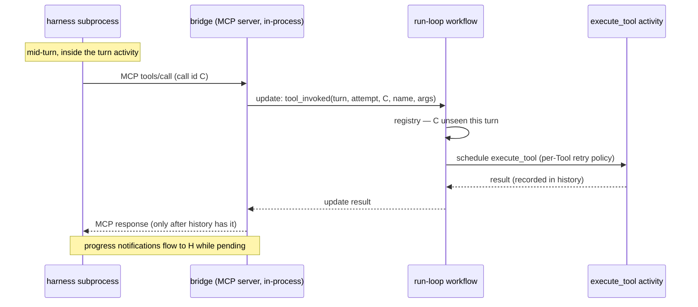

# Design Document: MCP Bridge

## Overview

The bridge is an in-process MCP server plus a thin client of the run-loop
workflow. It executes nothing itself. Every mid-turn tool call becomes a
**workflow update**; the workflow's registry — durable because it is workflow
state — is the only authority on whether a tool activity runs, and the harness
only ever observes results already recorded in history.

Behaviour sources: the launch plan's execution model (run loop = workflow,
turn = activity, update/signal in v0); harness ground truth from
`spikes/claude-driver/README.md` (claude 2.1.220) with Codex equivalents owed
by lane C's PoC; the MCP specification for `tools/*` and progress
notifications; requirements in `requirements.md` (this spec was authored
design-first; the two documents are kept in sync).

## Dependencies and Non-Goals

### Owning relationships

- **O2 (primitives)** owns the run-loop workflow and `Tool`; this design adds
  the registry and update handler *into* that workflow and consumes the
  frozen provider trait.
- **O3/O4 (providers)** own harness spawn/supervision; this design adds the
  spawn-time attachment contract (MCP config injection, timeout pinning,
  exit-4-tuple classification) they implement.
- **Engine repo T2** owns `Engine::embedded()`; `odori-engine` consumes it
  and registers `execute_tool` on the worker.

### Non-goals

- Exposing harness-native tools to the framework; MCP resources/prompts/
  sampling surfaces; cross-run result sharing; any turn-loop or supervision
  internals beyond the seams named above.
- Closing the regenerated-id residual (requirements, Target State): owned by
  tool idempotency contracts, not the bridge.

## Architecture

The data path — one blocked call crossing three runtimes:



Control plane: the provider injects the bridge endpoint + per-run token at
spawn; the runner supplies the turn's `Tool` set to the bridge before each
turn; `preview` gates all of it at the facade.

### Rejected alternatives

- **Execute tools inline in the bridge, journal to the store directly** —
  bypasses the workflow: no retry policy, no history ordering, a second
  durability path. Tokeira's own rule (history is the only durable
  authority) decides this.
- **Rendezvous in worker memory** (park the MCP request; complete it via a
  process-local channel) — dies with the process mid-await; reconciliation
  re-invents the registry in the wrong place.
- **One child workflow per tool call** — durable but pays workflow-start
  latency per call and scatters a turn's tool history; updates give the same
  await semantics inside the run's own history.

## Components and Interfaces

### Invocation registry (`odori-agents`, workflow-pure)

Pure state machine inside the run-loop workflow; no I/O, deterministic,
replay-rebuilt. The heart of Requirements 3 and 4.

```rust
// representative signatures, not full implementations
pub struct InvocationRegistry { /* per-turn map: CallId -> InvocationState */ }

pub enum Admission<'a> {
    /// Fresh: schedule execute_tool, then `complete`.
    Execute(ExecutionTicket),
    /// Recorded: return this result, schedule nothing.
    Recorded(&'a ToolResult),
    /// In flight: await the existing execution.
    Join(ExecutionHandle),
    /// Superseded attempt, unrecorded call: reject (fencing).
    Fenced,
}

impl InvocationRegistry {
    pub fn admit(&mut self, id: InvocationId, current_attempt: Attempt) -> Admission<'_>;
    pub fn complete(&mut self, ticket: ExecutionTicket, result: ToolResult);
}
```

### Update handler (`odori-agents`, run-loop workflow)

Registered on the workflow; validates the payload against the contract-policy
table, calls `admit`, schedules `execute_tool` on `Execute`, awaits, and
completes the update with the result — which is what makes record-before-
respond (Req 2.3) structural rather than disciplined.

### Bridge server (`odori-mcp-bridge`, behind `preview`)

Streamable-HTTP MCP server on `127.0.0.1:0`; per-run bearer token check
before anything else; `tools/list` from the turn's `Tool` set; `tools/call` →
update via the Temporal client; keepalive scheduler emitting progress at a
configured cadence, fed by activity heartbeats when present, synthesized
otherwise.

```rust
pub struct Bridge { /* listener, run token, tool catalogue, client */ }

impl Bridge {
    pub async fn serve(config: BridgeConfig, client: WorkflowClient) -> Result<BridgeHandle>;
}

pub struct HarnessAttachment {
    /// e.g. {"mcpServers":{"odori":{"type":"http","url":...,"headers":...}}}
    pub mcp_config_json: String,
    pub allowed_tools: Vec<String>,
}
```

### Provider attachment (`odori-providers`)

Claude: `--mcp-config` (inline or temp file) + `--allowedTools`, plus MCP
timeout pinning at spawn (Req 5.3). Codex: `mcp_servers` on session start;
stdio re-exec shim as the committed fallback (Q1). Exit classification
extends the O3 4-tuple with "died awaiting MCP" (the bridge knows which
invocations were pending at exit).

### Wiring (`odori-engine`, facade)

`odori-engine` registers `execute_tool` on the worker and injects the
idempotency context (Req 2.4). The facade (`odori`) is the only place
`odori-agents` output meets `odori-mcp-bridge` — preserving Req 8.5's
no-compile-time-dependency rule.

## Data Models

- **`InvocationId { turn: TurnId, attempt: Attempt, call_id: CallId }`** —
  fields per the update-payload policy table (requirements). `call_id` is the
  harness tool-use id (opaque string; stability across resume is Q2).
- **`InvocationState`** — `InFlight { attempt_started: Attempt } |
  Complete { result: ToolResult }`. Workflow state; never in bridge memory
  beyond a request's lifetime.
- **`ToolResult`** — MCP tool-result shape (content blocks + `is_error`),
  serialized into history via the update completion; size policy is Q4.
- **`BridgeConfig`** — keepalive cadence, harness MCP timeout (the pinned
  value it must stay below), server name (`odori`, Q7).

## Correctness Properties

*A property is a statement that holds across all valid executions — the
bridge between a human-readable spec and a machine-checkable guarantee.*

### Property 1: At-most-once execution per identity

*For any* sequence of `tools/call` presentations for one turn — including MCP
client retries, same-attempt re-presentations, and re-presentations from
later attempts after resume — the registry admits at most one `Execute` per
(turn, call id); every other presentation of that pair yields `Recorded` or
`Join`, and the result every presentation receives is byte-identical.

**Validates: Requirements 3.1, 3.2, 3.3, 7.4**

### Property 2: Record before respond

*For any* interleaving of update completion and bridge response delivery, a
`tools/call` response observable by the harness implies the corresponding
result is already recorded in workflow history (equivalently: no execution of
the bridge ever returns a result whose update has not completed).

**Validates: Requirements 2.3**

### Property 3: Registry replay equivalence

*For any* prefix of a run truncated at an arbitrary crash point and replayed,
the rebuilt registry is state-equivalent to the pre-crash registry (same
entries, same states, same recorded results), with no contribution from
bridge memory.

**Validates: Requirements 3.4, 7.2**

### Property 4: Fencing

*For any* interleaving of calls stamped with current and superseded attempts,
no call from a superseded attempt causes an `Execute` admission; superseded
calls yield `Recorded` where the pair is recorded and `Fenced` otherwise.

**Validates: Requirements 4.1, 4.2, 4.3**

### Property 5: Keepalive cadence bound

*For any* pending call whose update takes T to complete, and any configured
harness MCP timeout H greater than the keepalive cadence k, the gap between
consecutive bridge emissions observable by the harness (progress or the final
response) never reaches H.

**Validates: Requirements 5.1, 5.2, 5.3**

### Property 6: Failure classes are preserved

*For any* injected failure — tool retry exhaustion, update-path fault, or
harness death mid-await — the surface observed matches the taxonomy exactly:
tool exhaustion → MCP tool result `isError: true` and the turn continues;
update-path fault → MCP protocol error and a retryable turn failure; harness
death → retryable turn failure with in-flight executions running to
completion and recording. No failure ever surfaces as a different class.

**Validates: Requirements 6.1, 6.2, 6.3, 6.4, 6.5, 6.6**

### Property 7: `preview`-off inertness

*For any* run compiled or configured with `preview` disabled, no bridge
listener exists, no MCP configuration reaches the harness spawn, and no
bridge code path executes — while the `Tool`-bearing program compiles and
runs unchanged.

**Validates: Requirements 8.1, 8.2, 8.3, 8.4**

## Error Handling

| Condition | Internal error | External surface |
|---|---|---|
| Missing/invalid bearer token | `BridgeError::Unauthorized` | HTTP 401; no MCP processing |
| Unknown MCP method (resources/prompts/…) | `BridgeError::Unsupported` | JSON-RPC `method_not_found` |
| Unknown tool name in `tools/call` | `BridgeError::UnknownTool` | JSON-RPC `invalid_params` |
| Empty/malformed call id or turn | `BridgeError::BadInvocation` | JSON-RPC `invalid_params` |
| Arguments fail the `Tool` schema | `ToolError::InvalidArgs` | MCP tool result `isError: true` (model-visible) |
| `execute_tool` retries exhausted | `ToolError::Exhausted` | MCP tool result `isError: true` (model-visible) |
| Superseded attempt, unrecorded call | `RegistryError::Fenced` | JSON-RPC error, fencing code; turn unaffected |
| Update transport failure | `BridgeError::Engine` | JSON-RPC `internal_error`; turn activity fails retryable |
| Result exceeds size policy | open — Q4 | open — Q4 |

## Testing Strategy

- **Property tests (required):** Properties 1–7, ≥100 iterations each,
  `proptest` (the workspace standard — engine-repo convention; enters this
  workspace as a dev-dependency, flagged as dependency movement).
  - P1, P3, P4: `odori-agents` — the registry is a pure state machine;
    generate presentation/crash/attempt interleavings against a reference
    model.
  - P2: `odori-mcp-bridge` — bridge core against a fake update client with
    controllable completion ordering.
  - P5: `odori-mcp-bridge` — keepalive scheduler under generated (T, H, k)
    and heartbeat patterns, virtual time.
  - P6: `odori-mcp-bridge` + `odori-providers` — generated failure
    injections against the taxonomy mapping.
  - P7: facade integration test compiled both ways (feature matrix in CI
    scripts), asserting no listener/injection with `preview` off.
- **Unit tests (example-based):** token rejection, `tools/list` content,
  contract-policy table rows (each error row exercised once), MCP framing
  edges.
- **Integration tests:** end-to-end bridged turn against both harnesses
  (pinned versions) behind an ignored-by-default marker (subscription
  quota); crash-mid-turn recovery driven through the embedded engine with a
  scripted fake harness for determinism.
