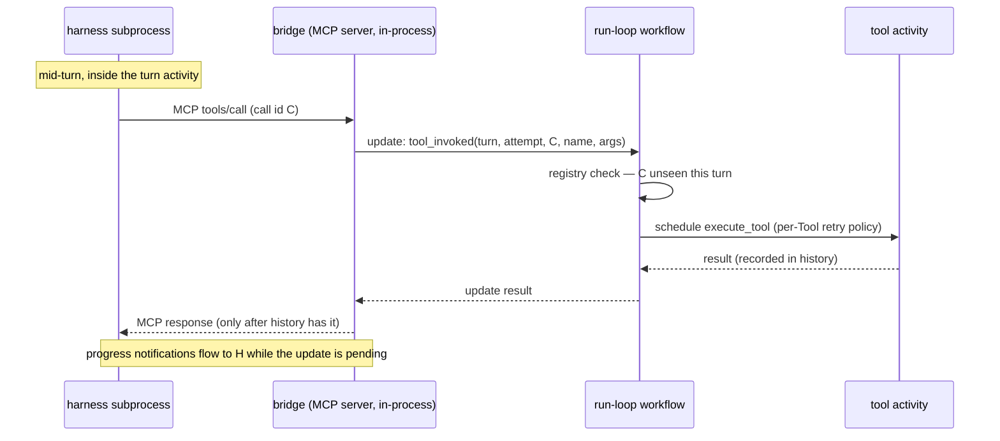

# The MCP bridge: durable tools inside a harness turn

**Status:** draft for review (Ian). This document freezes before implementation
begins (slice O6, day 25). **Crate:** `odori-mcp-bridge`. **Feature:**
`preview` (descope ladder rung 3).

## 1. The problem

Odori's execution model is: the run loop is a workflow; one harness turn is one
activity. A turn activity spawns the vendor harness (headless Claude Code, or
the Codex app-server) as a supervised subprocess and waits for the turn to
finish.

Mid-turn, the model may call a tool the *framework* owns — a `Tool` registered
on the `Agent`. That execution must be durable: a tokeira activity with its own
retry policy, recorded in the run's history, surviving crashes of the tool, the
harness, and the whole process. But the caller is a subprocess blocked on an
MCP response, inside an activity, inside a workflow. Three runtimes are
stacked, and the durability boundary sits in the middle of the innermost one's
turn.

Everything hard about the bridge follows from one fact: **the harness is not
replay-aware**. Tokeira replays workflow history deterministically; the harness
replays *its own* session history on resume and re-issues work. The bridge is
where those two replay models meet, and its job is to make the meeting
idempotent.

## 2. Shape of the solution

The bridge is an in-process MCP server plus a thin client of the run-loop
workflow. It executes nothing itself. Every tool call becomes a **workflow
update**; the workflow is the only component that decides whether a tool
executes, because the workflow is the only component with durable memory.

The turn activity and the tool activity are peers in the same workflow's
history; the bridge is stateless plumbing between them. That single design
decision — registry in the workflow, not the bridge — is what makes every
crash story below tractable.

Three alternatives were rejected:

- **Execute tools inline in the bridge, journal to the store directly.**
  Bypasses the workflow: no retry policy, no history ordering, a second
  durability path to keep consistent. Tokeira's own rule — history is the only
  durable authority — decides this.
- **Rendezvous in worker memory** (bridge parks the MCP request; a
  workflow-scheduled activity completes it via a process-local channel). Works
  until the process restarts mid-await; then the parked request is gone but
  the activity result is in history, and reconciliation logic re-invents the
  registry anyway — in the wrong place.
- **One child workflow per tool call.** Durable, but pays workflow-start
  latency per call and scatters a turn's tool history across workflows;
  updates give the same await semantics inside the run's own history.

## 3. The in-process MCP server, and pointing each harness at it

**Transport: streamable HTTP on `127.0.0.1`, ephemeral port, one server per
Odori process.** The bridge cannot be a stdio MCP server in the usual sense —
stdio servers are children of the harness, and the bridge must live in the
framework process where the Temporal client and the embedded engine already
are. Loopback HTTP inverts the direction: the harness connects to us.

- **Auth:** a per-run bearer token minted at engine start, passed to the
  harness in its MCP config. Loopback is not isolation — any local process
  can reach the port; the token makes framework tools callable only by
  harnesses we spawned. Invocations also carry the turn/attempt identity
  (§5), so a token alone cannot impersonate a live attempt.
- **Claude Code:** `--mcp-config` with an inline/temp-file config declaring
  one HTTP server (working name `odori`), plus `--allowedTools` scoped to the
  bridge's tools. Confirmed present in the pinned CLI (2.1.220) by the
  claude-driver spike.
- **Codex:** `mcp_servers` config on the app-server session (`-c` overrides
  on session start). Whether the pinned Codex supports HTTP MCP servers
  directly or needs a **stdio shim** — a re-exec of the host binary in a
  proxy mode that forwards stdio ⇄ loopback — is open question **Q1**; the
  shim is the committed fallback and changes nothing above the transport.
- The tool list the bridge serves is the `Agent`'s `Tool` set for the current
  turn, so `tools/list` is deterministic per turn and namespaced under the
  one server name the model sees.

## 4. Tool call → activity: the update path

On `tools/call` the bridge issues a workflow **update** (not a signal: the
caller needs the result, and update-with-result is exactly MCP's
request/response shape) against the run-loop workflow, carrying the invocation
identity (§5), tool name, and arguments.

The update handler, in the workflow:

1. **Fence** the attempt (§5): a call stamped with a superseded turn attempt
   cannot start new work.
2. **Consult the registry** (workflow state): if this invocation identity is
   recorded, return the recorded result — no activity. If it is in flight,
   await the same activity — never a second one.
3. Otherwise **schedule `execute_tool`** with the per-`Tool` retry policy and
   timeouts, record "in flight", await, record the result, and complete the
   update with it.

The bridge answers the MCP request only when the update completes — i.e. only
after the result is in history (invariant **I4**). The harness can never
observe a result the workflow could later forget.

Activity context (run id, turn, attempt, invocation id) rides into
`execute_tool`, so tool authors get an idempotency key for their own side
effects for free.

**Payload sizes** ride through update arguments, history, and MCP responses;
oversized tool results need an offload policy (open question **Q4**).

## 5. Idempotency: where the two replays meet

An invocation's identity is **(turn, attempt, call id)** — the call id being
the harness's tool-use id, which lives in the harness's own session history.
The registry keys on **(turn, call id)**; the attempt is a fencing dimension,
not an identity dimension. The distinction is the heart of the design:

- **Same attempt re-presents a call id** — the harness's MCP client timed out
  and retried, or the harness process was resumed mid-attempt. Registry hit →
  recorded result (or join in-flight). One execution.
- **New attempt re-presents an old call id** — the turn activity failed and
  retried; the resumed session replays its history and re-issues the pending
  tool call *with the id recorded in that history*. Registry hit → recorded
  result. The tool does not run twice even though the turn did. This is why
  the registry must not be scoped per attempt: cross-attempt replay is the
  normal recovery path, not an edge case.
- **Stale attempt presents anything** — a zombie harness from attempt N calls
  after attempt N+1 started (kill-on-drop failed, network straggler). Fencing:
  answered from the registry if recorded, **rejected** if it would start new
  work (invariant **I5**). Attempts are monotonic; the workflow knows the
  current one because the turn activity's own scheduling defines it.

**The honest residual:** if the tool executed but the harness died before its
session file recorded the `tool_use` block, the retried attempt's model
*regenerates* the call under a **fresh id**. No key can connect the two — the
first execution is orphaned in history and the tool runs again. The window is
narrow (activity completed ∧ session not yet flushed) but real, and no bridge
design closes it without vendor cooperation, because the id is born inside the
harness. Therefore: **framework tools must be idempotent or compensatable**;
the docs say so; `execute_tool`'s injected idempotency key gives authors the
handle. Whether we add a heuristic second-level dedupe (args-hash within a
turn) is open question **Q3** — it trades a rare duplicate for a rare *wrong
dedupe* of legitimately repeated calls, and the current draft says no.

Call-id stability across session resume is load-bearing for the second bullet
and is asserted from session-history mechanics, not yet from observation; the
spike's live probes verify it per harness before the doc freezes (**Q2**).

## 6. Timeouts: three clocks, one ordering

Three independent clocks tick over one blocked call: the harness's MCP client
timeout, the turn activity's timeouts, and the tool activity's timeouts. The
bridge's job is to keep the fast clock from firing while the slow clock is
legitimately working.

- **Harness MCP timeout.** Both harnesses bound MCP calls (Claude Code:
  configurable, env/config; Codex: config). MCP's progress notifications
  reset a compliant client's timeout. The bridge emits progress on a fixed
  cadence while an update is pending — sourced from `execute_tool` heartbeats
  when the tool reports them, synthesized keepalives when it doesn't.
  **Invariant I6:** keepalive cadence strictly below the smallest configured
  harness MCP timeout, and the provider pins/raises that timeout at spawn so
  the bound is known, not guessed.
- **Tool activity.** Per-`Tool` start-to-close (+ heartbeat timeout if the
  tool heartbeats) and retry policy. This is the clock that is *allowed* to
  be long.
- **Turn activity.** Its start-to-close must cover model latency plus tool
  time — or fail first, which is survivable but wasteful: the retried turn
  replays the call and joins the still-in-flight execution (§5), so the
  ordering is a cost concern, not a correctness one. Guidance: turn
  start-to-close ≥ the longest tool schedule-to-close among the agent's
  tools, and the turn activity heartbeats off harness stream events (the
  spike confirms `system:init` and streamed events make natural liveness
  ticks) so a wedged harness dies by heartbeat-timeout quickly regardless.

## 7. Failure taxonomy

Distinct failures get distinct surfaces; conflating them turns retryable
noise into run-fatal errors and vice versa.

| failure | detected by | surfaced as | retried by |
| --- | --- | --- | --- |
| **Tool failure** — `execute_tool` exhausts its retry policy | workflow update path | MCP **tool result with `isError: true`**; the model sees it and adapts in-turn | the tool's own policy only; *not* a turn failure |
| **Bridge failure** — update RPC fails, engine unreachable, malformed frame | bridge | MCP **protocol error**; turn activity fails retryable | turn activity retry |
| **Harness death mid-await** — child exits with calls in flight | turn activity (process exit + spike's exit taxonomy) | turn activity fails retryable; in-flight tool activities **run to completion** and record (recommended — their results are exactly what the resumed session's replay will ask for; **Q6**) | turn retry → session resume → registry hits |
| **Framework process death** — everything at once | tokeira recovery | engine restores (snapshot + history replay); workflow resumes; registry rebuilt *by replay* because it is workflow state (**I3**); turn activity reschedules; harness session persists on the CLI's own disk and resumes | tokeira |
| **Stale attempt** — zombie calls after supersession | fencing (§5) | recorded result, or rejection | never |

The provider's exit-code work (claude-driver spike) feeds row three: harness
death is classified from `(exit code, result-event-arrived, terminal_reason,
stderr)`, and "died awaiting MCP" is distinguishable because the bridge knows
which invocations were pending when the child exited.

## 8. Crash-mid-turn, end to end

The composite recovery story, tying §5–§7 together — worker process dies while
a 10-minute tool runs under a turn:

1. Attempt 1: model calls `deploy_preview` (call id `C`); update recorded
   in-flight; `execute_tool` running; process dies at minute 3.
2. Engine restores from snapshot; history replay rebuilds the workflow —
   registry says `C`: in flight. The activity is rescheduled per its policy
   (its retry, not the turn's). The turn activity is also rescheduled:
   attempt 2.
3. Attempt 2 spawns the harness with `--resume <session>`; the session's
   history holds the pending `tool_use C`; the harness re-issues `C` to the
   bridge.
4. The update for `C` joins the in-flight execution. Progress keepalives hold
   the harness open. The tool finishes; history records it; the update
   completes; the harness gets the result and the turn proceeds as if nothing
   happened.
5. Any straggler from attempt 1's harness (if the OS kept it alive) is fenced.

Retries of the *turn* for model-side reasons (harness flake, api_error) use
`--fork-session` per the spike's recommendation, so divergent attempt
histories never contaminate the session lineage the run loop records — the
fork still carries prior turns' history, so registry semantics are unchanged.

## 9. The `preview` boundary

The bridge ships behind the `preview` feature (descope ladder rung 3).

- **`preview` off (default at rung 3):** the bridge is inert — no loopback
  listener, no MCP config injected at spawn, no update handlers registered.
  Framework `Tool`s **delegate to the harness's own tooling**: the runner
  maps tool intent onto the harness's native toolset (its own shell, files,
  permissions, `--allowedTools`), and the durability boundary is the whole
  turn — a retried turn re-runs its tool effects with the harness's own
  semantics. That is v0-honest: it is exactly what a bare harness gives you
  today, stated in the docs as such.
- **`preview` on:** framework tools execute as activities with everything
  this document specifies.
- The `Tool` API surface is identical under both; only the execution
  substrate and the stated guarantees change. Nothing in `odori-agents` may
  compile-time depend on the bridge (the feature lives on `odori-mcp-bridge`
  and the facade wires it), so flipping the flag is a behavior change, never
  an API change.

## 10. Invariants

Binding on the O6 implementation; a PR violating one changes this document
first.

- **I1 — No side effect outside an activity.** With `preview` on, every
  framework-tool execution is a tokeira activity in the run workflow's
  history.
- **I2 — At-most-once per identity.** One invocation identity maps to at most
  one execution lineage; re-presentation returns the recorded result or joins
  the in-flight execution. (The regenerated-id residual of §5 is outside any
  identity, and is owned by tool idempotency contracts.)
- **I3 — The bridge is memoryless.** The invocation registry is workflow
  state, rebuilt by replay; bridge process memory is disposable at any
  instant.
- **I4 — Record before respond.** The harness never observes a tool result
  that is not already in workflow history.
- **I5 — Stale attempts are fenced.** A superseded attempt can read recorded
  results but can never start new work.
- **I6 — No silent awaits.** While an update is pending, progress flows to
  the harness at a cadence strictly below its MCP timeout.
- **I7 — Failures keep their class.** Tool failure, bridge failure, and
  harness death map to the three distinct surfaces of §7 and are never
  conflated.
- **I8 — `preview` off means off.** No listener, no injection, no bridge code
  on any hot path.

## 11. Open questions for Ian

- **Q1 — Codex transport.** Does the pinned Codex app-server accept HTTP MCP
  servers, or do we commit the stdio re-exec shim from day one? (Codex-driver
  PoC, lane C, answers this; the shim is the fallback either way.)
- **Q2 — Call-id stability on resume.** Asserted from session-history
  mechanics for both harnesses; must be verified live before freeze
  (claude-driver spike is auth-blocked at the moment — see PR #1).
- **Q3 — Second-level dedupe.** Accept the narrow regenerated-id duplicate
  window (current draft), or add an args-hash heuristic with its wrong-dedupe
  risk?
- **Q4 — Result size policy.** Tool results ride updates → history → MCP.
  Cap-and-fail, or offload beyond a threshold (and to where, in an embedded
  in-memory world with snapshots)?
- **Q5 — Loopback auth depth.** Per-run bearer token (draft), or per-attempt
  tokens folded into the fencing story?
- **Q6 — Orphaned in-flight tools.** Run-to-completion-and-record on harness
  death (draft, feeds resume replay), or cancel-and-rerun for
  side-effect-averse tools — per-`Tool` policy?
- **Q7 — Server naming.** The MCP server name is model-visible prompt
  surface. `odori` (draft), or something more instructive per agent?

## Appendix: ground truth this design leans on

From `spikes/claude-driver` (claude 2.1.220): `--mcp-config` /
`--allowedTools` / `--resume` / `--fork-session` confirmed on the pinned CLI;
turn liveness observable from stream events (`system:init` ≈ 0.5–1.1 s);
harness failures classifiable from `(exit, result-event, terminal_reason,
stderr)`; spawn env must be scrubbed of inherited vendor transport variables.
Codex-side equivalents come from lane C's Codex-driver PoC before this
document freezes.
